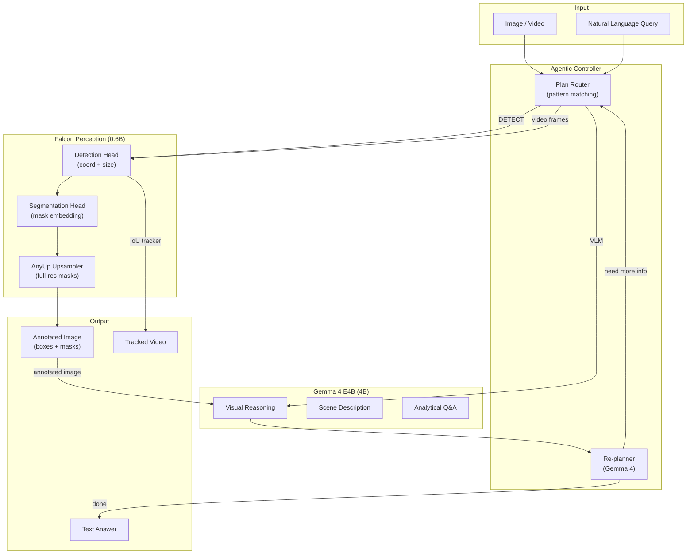
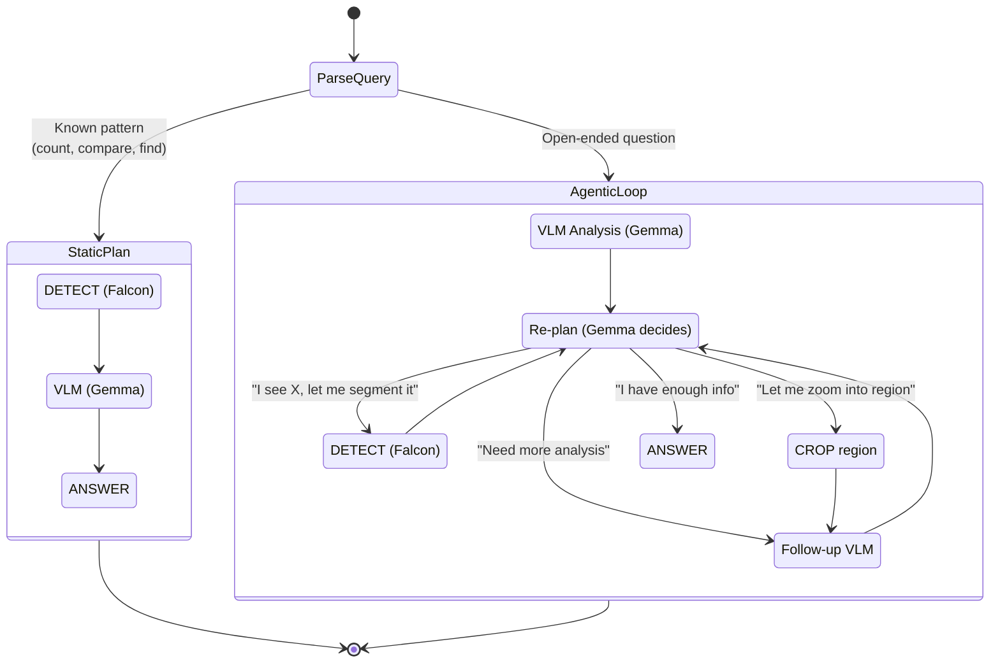
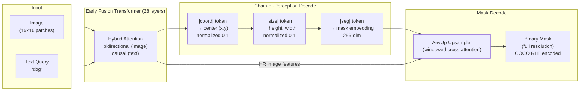
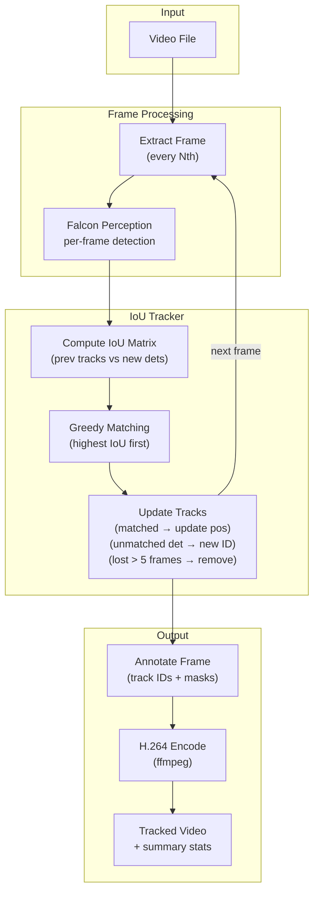
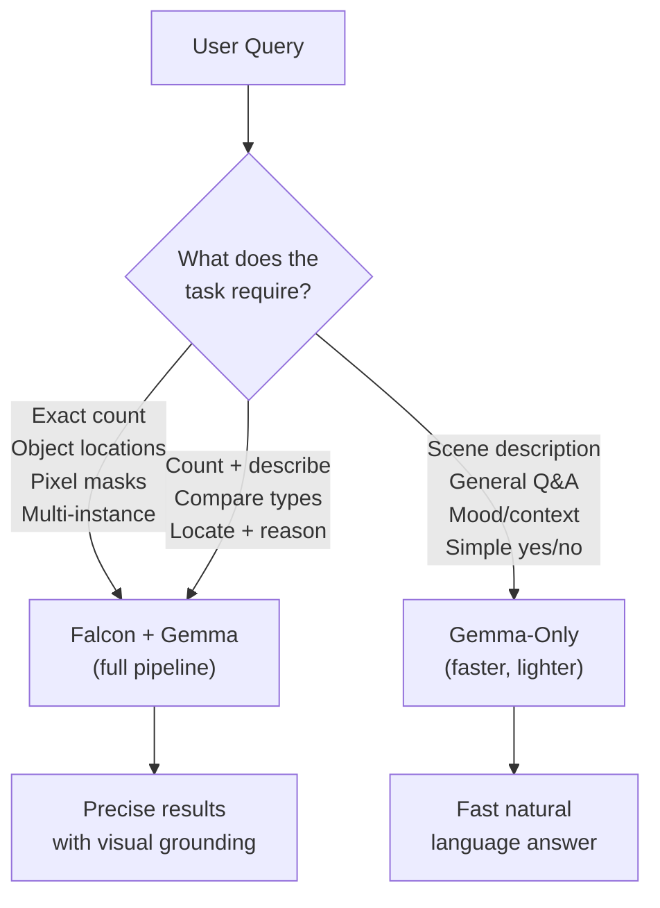
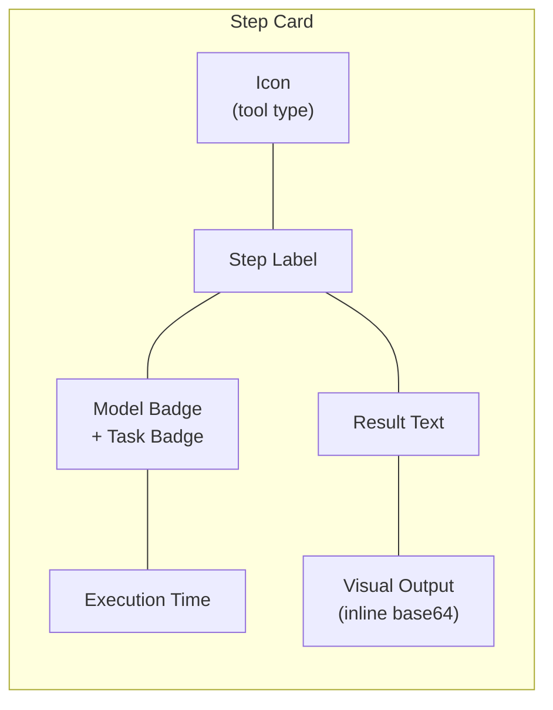

# Vision Agent Studio — Architecture

## Overview

Vision Agent Studio is an agentic pipeline that combines **Falcon Perception** (instance segmentation) with **Gemma 4** (visual reasoning) to perform multi-step visual analysis on images and video. All inference runs locally on Apple Silicon via MLX.

| Component | Model | Params | Quantization | Role |
|---|---|---|---|---|
| **Falcon Perception** | `tiiuae/Falcon-Perception` | 0.6B | float16 | Object detection + instance segmentation |
| **Gemma 4** | `mlx-community/gemma-4-e4b-it-8bit` | 4B effective (8B total) | 8-bit | Visual reasoning, scene understanding, re-planning |

---

## High-Level Architecture



---

## Agentic Loop (Re-planning)

The agent doesn't follow a fixed pipeline. For open-ended queries, Gemma decides what to do next after each step:



**Max steps**: 8 (safety limit to prevent infinite loops)

---

## Falcon Perception — Chain-of-Perception Decoding

Falcon Perception uses a single early-fusion Transformer. Unlike traditional pipelines with separate vision encoders and decoders, it processes image patches and text tokens together from the first layer.



For each detected instance, the model outputs the sequence: **coord → size → seg** autoregressively. The seg embedding is dot-producted with upsampled image features to produce a full-resolution binary mask.

---

## Video Tracking Pipeline



**Tracking algorithm**: Greedy IoU matching with threshold 0.3. Tracks lost for >5 frames are removed. New unmatched detections create new track IDs.

---

## Gemma-Only vs. Falcon+Gemma: Comparison

We ran both approaches on identical images with identical questions.

### Counting Accuracy

| Task | Gemma-Only Answer | Falcon+Gemma Count | Ground Truth (approx) |
|---|---|---|---|
| **Dogs in image** | "two" | **2** (exact, with masks) | 2 |
| **Cars in street** | "at least 10 yellow taxis" (vague) | **16** (exact, with masks) | ~15-18 |
| **People in street** | "approximately 25-30" (estimate) | **31** (exact, with masks) | ~25-35 |

### Qualitative Analysis

| Capability | Gemma-Only | Falcon+Gemma |
|---|---|---|
| **Exact counting** | Approximate for >5 objects. Says "at least", "approximately". | Exact count with per-instance bounding boxes. |
| **Spatial localization** | Can say "left" or "right" but no coordinates. | Pixel-precise bounding boxes + segmentation masks. |
| **Instance separation** | Cannot distinguish overlapping objects. | Each instance gets a separate mask. |
| **Breed/type identification** | Good — identified Corgi and Yorkshire Terrier correctly. | Requires Gemma VLM as second step (Falcon only detects, doesn't classify breeds). |
| **Scene understanding** | Strong — describes activities, mood, context. | Needs Gemma VLM for reasoning; Falcon alone only detects. |
| **Speed (simple query)** | 1-4s per query | 3-25s per query (depends on object count) |
| **Memory footprint** | ~5 GB (8-bit quantized) | ~8 GB total (Falcon float16 + Gemma 8-bit) |

### When to Use Each



**Bottom line**: Gemma alone is sufficient for scene understanding and simple questions, but it **cannot reliably count** objects (especially >5) or provide **spatial grounding** (bounding boxes, masks). Falcon Perception fills this gap — it provides the structured visual evidence that Gemma can then reason over.

---

## Step-by-Step UI Architecture

The Vision Agent Studio renders each pipeline step as a card showing:



| Badge | Model | Color |
|---|---|---|
| `Falcon Perception (0.6B)` | Instance Segmentation / Detection | Indigo |
| `Gemma 4 E4B (4B)` | Visual Reasoning / Re-planning | Violet |
| `—` | Crop / Compare / Answer (utility) | Amber / Cyan / Emerald |

---

## File Structure

```
Gemma-4/
├── agent_studio.py      # Main app — agentic step-by-step UI
├── agent.py             # Agent logic (plan + execute)
├── app.py               # Original image analysis app
├── demo.py              # Unified image + video UI
├── video_tracker.py     # Video tracking pipeline
├── main.py              # Combined launcher
├── test_data/           # Test images + videos
│   ├── dogs.jpg
│   ├── street.jpg
│   ├── kitchen.jpg
│   ├── dogs_video.mp4
│   └── test_panning.mp4
├── step_outputs/        # Temp step images for UI
└── .venv/               # Python 3.12 virtual environment
```

---

## Running

```bash
# Activate environment
source .venv/bin/activate

# Vision Agent Studio (step-by-step agentic UI)
python agent_studio.py    # → http://localhost:7860

# Unified demo (image + video tabs)
python demo.py            # → http://localhost:7860

# Video tracking only
python video_tracker.py   # → http://localhost:7861
```

---

## Model Details

### Falcon Perception
- **Architecture**: Single early-fusion Transformer (no separate vision encoder)
- **Parameters**: 0.6B (28 layers, 16 heads, 128 head_dim)
- **Input**: Image patches (16x16) + text tokens in shared sequence
- **Output**: Chain-of-Perception (coord → size → seg) per instance
- **Mask decoding**: Segmentation embedding dot-producted with upsampled image features
- **Training**: 54M images, 195M positive expressions, 3-stage training
- **Paper**: arXiv:2603.27365

### Gemma 4 E4B
- **Architecture**: MatFormer (activates 4B of 8B total params)
- **Quantization**: 4-bit (MLX)
- **Capabilities**: Image, audio, video understanding + text generation
- **Input**: Image + text prompt via chat template
- **Output**: Free-form text (up to 512 tokens)
- **Key limitation**: Cannot produce bounding boxes or masks (no spatial tokens)
